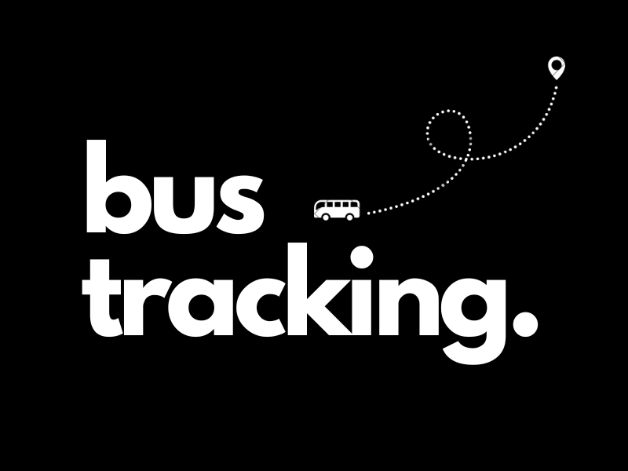

<h1 align="center"> Bus Tracking System </h1>
<p align="center">This development research aims to increase productivity and reduce time mismanagement among students who rely on buses for transportation. The study proposes a system that includes hardware and software components to track multiple buses on campus and display their location data in real time through a mobile application.</p>


### Description
 - Our solution mainly consists of hardware and software components.
   
 - The front end was created using React and VuePWA. We wanted
   our solution to reach the masses, and that's why we chose to use these technologies.
  
 - For the backend, we used Node.js, as it was easier to
   integrate with React, without any hassle to manage & create
   instances of our server. 


## Setup

  ##### Clone the repository
```bash
git clone https://github.com/seths10/bt-front.git
```
  ##### To run it, navigate to `bt-front`
```bash
cd bt-front
npm run dev
```

  ##### To run the app server, navigate to the \`_application-server_` directory
```bash
cd application-server
node webhook.js
``````


## About
Our solution primarily deals with productivity and time management. When it comes to school, every second counts! We're the **BT Team**! 

##### Made with ♥ by 

<p align="left">
<a href="https://github.com/seths10"></a>
<a href="https://github.com/shineteye"></a>

</p>

# <!-- [](https://github.com/seths10) -->
